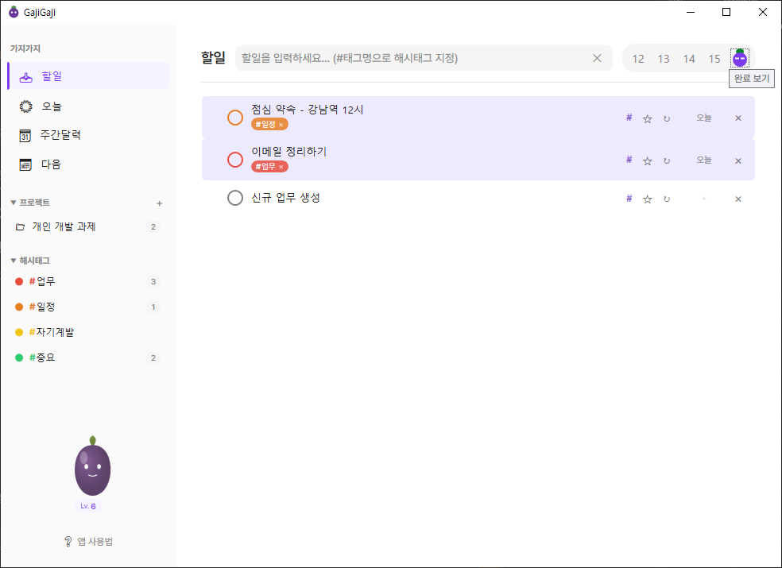

# GajiGaji 랜딩 페이지 설정 가이드

## 1단계: 에셋 준비

### 필수 이미지 파일

`images/` 폴더에 다음 파일들을 추가하세요:

| 파일명 | 용도 | 권장 크기 | 형식 |
|--------|------|-----------|------|
| `favicon.png` | 브라우저 탭 아이콘 | 32x32px | PNG |
| `og-image.png` | SNS 공유 미리보기 | 1200x630px | PNG |
| `screenshot-main.png` | 메인 화면 | 1280x800px | PNG |
| `screenshot-week.png` | 주간 캘린더 | 1280x800px | PNG |
| `screenshot-dark.png` | 다크 모드 | 1280x800px | PNG |

### 스크린샷 촬영 방법

1. **Windows 캡처 도구** 또는 **Win + Shift + S** 사용
2. 앱을 최대화하거나 적절한 크기로 조정
3. 깔끔한 데모 데이터로 스크린샷 촬영
4. 개인정보가 포함되지 않도록 주의

### 이미지 최적화 (권장)

- [TinyPNG](https://tinypng.com/) - 무료 PNG 압축
- [Squoosh](https://squoosh.app/) - Google의 이미지 최적화 도구

---

## 2단계: HTML 수정

### 다운로드 링크 설정

`index.html`에서 GitHub 사용자명과 저장소명을 수정하세요:

```html
<!-- 변경 전 -->
<a href="https://github.com/YOUR_USERNAME/GajiGaji/releases/latest">

<!-- 변경 후 (예시) -->
<a href="https://github.com/myhome/gajigaji/releases/latest">
```

수정해야 할 위치:
- Hero 섹션의 GitHub 버튼
- Download 섹션의 다운로드 버튼
- Footer의 GitHub 링크들

### 스크린샷 추가

스크린샷 플레이스홀더를 실제 이미지로 교체하세요:

```html
<!-- 변경 전 -->
<div class="screenshot-placeholder">
    <span>메인 화면 스크린샷</span>
</div>

<!-- 변경 후 -->

```

---

## 3단계: GitHub 저장소 생성

### 새 저장소 만들기

1. [GitHub](https://github.com) 로그인
2. 우측 상단 **+** → **New repository**
3. 설정:
   - Repository name: `gajigaji-landing` (또는 원하는 이름)
   - Public 선택
   - "Add a README file" 체크 해제

### 코드 업로드

```bash
cd landing-page

# Git 초기화
git init

# 모든 파일 추가
git add .

# 첫 번째 커밋
git commit -m "Initial landing page"

# 원격 저장소 연결 (YOUR_USERNAME을 실제 사용자명으로 변경)
git remote add origin https://github.com/YOUR_USERNAME/gajigaji-landing.git

# 푸시
git branch -M main
git push -u origin main
```

---

## 4단계: Cloudflare Pages 배포

### 계정 생성
1. [Cloudflare Dashboard](https://dash.cloudflare.com/sign-up) 접속
2. 무료 계정 생성 (이메일 인증 필요)

### Pages 프로젝트 생성

1. 대시보드에서 **Workers & Pages** 클릭
2. **Create application** → **Pages** 탭 선택
3. **Connect to Git** 클릭
4. GitHub 계정 연결 허용
5. `gajigaji-landing` 저장소 선택

### 빌드 설정

| 설정 | 값 |
|------|-----|
| Production branch | `main` |
| Build command | (비워두기) |
| Build output directory | (비워두기 또는 `/`) |

6. **Save and Deploy** 클릭

### 배포 완료

- 배포 URL: `gajigaji-landing.pages.dev`
- 이후 GitHub에 push하면 자동 배포됨

---

## 5단계: 커스텀 도메인 (선택)

### Cloudflare에서 도메인 설정

1. Pages 프로젝트 → **Custom domains**
2. **Set up a custom domain**
3. 구매한 도메인 입력
4. DNS 설정 자동 완료 (Cloudflare DNS 사용 시)
5. SSL 인증서 자동 발급

### 무료 도메인 옵션
- 기본 제공: `*.pages.dev` (무료)
- Freenom: `.tk`, `.ml` 등 (무료, 불안정)
- 유료 구매: `.com`, `.app` 등 (연 $10~15)

---

## 폴더 구조

```
landing-page/
├── index.html          ← 메인 페이지
├── css/
│   └── style.css       ← 스타일
├── js/
│   └── main.js         ← 다크모드, 애니메이션
├── images/             ← 이미지 폴더 (직접 추가)
│   ├── favicon.png
│   ├── og-image.png
│   ├── screenshot-main.png
│   ├── screenshot-week.png
│   └── screenshot-dark.png
└── SETUP.md            ← 이 가이드
```

---

## 체크리스트

```
[ ] 스크린샷 3장 촬영 및 최적화
[ ] favicon.png 생성
[ ] og-image.png 생성 (SNS 공유용)
[ ] index.html에서 GitHub 링크 수정
[ ] 스크린샷 플레이스홀더를 실제 이미지로 교체
[ ] GitHub 저장소 생성 및 푸시
[ ] Cloudflare Pages 연결 및 배포
[ ] 배포된 사이트 테스트
```

---

## 도움이 필요하면

- 문제 발생 시 GitHub Issues에 문의
- Cloudflare Pages 문서: https://developers.cloudflare.com/pages/
